# 🌩️ CloudHive 

CloudHive is a modern, unified cloud storage management platform that revolutionizes how users interact with their cloud storage. Built with cutting-edge technologies including Next.js 14, TypeScript, and MongoDB, it provides a seamless and intuitive experience for managing multiple Google Drive accounts from a single, powerful interface. Our goal is to provide a unified platform that makes cloud storage management accessible to everyone.


## 🙌 Key Benefits

- **Unified Dashboard**: Access and manage all your Google Drive accounts through a single, intuitive dashboard
- **Cross-Account Management**: Seamlessly switch between accounts, transfer files, and manage permissions across different drives
- **Smart Organization**: Advanced file organization with AI-powered suggestions and automated categorization
- **Real-Time Sync**: Instant synchronization across all connected accounts with automatic conflict resolution
- **Enhanced Security**: Enterprise-grade security with end-to-end encryption and granular access controls
- **Performance Optimized**: Built with performance in mind, featuring smart caching and efficient resource management
- **Mobile-First Design**: Fully responsive interface that works flawlessly on both desktop and mobile devices

## 🌟 Features

- **Multi-Account Management**: Connect and manage multiple Google Drive accounts
- **Unified Interface**: Access all your cloud storage in one place
- **Real-time Updates**: Automatic token refresh and status updates
- **Responsive Design**: Works seamlessly on both desktop and mobile devices
- **Secure Authentication**: Firebase-based authentication system
- **Smart Caching**: Redis-powered caching for optimal performance
- **Token Management**: Automated refresh token handling with daily validation

## 📱 Demo

### Drive Management
<div style="display: flex; flex-direction: row; justify-content: space-evenly; flex-wrap: wrap; width:100%; gap: 50px;">
  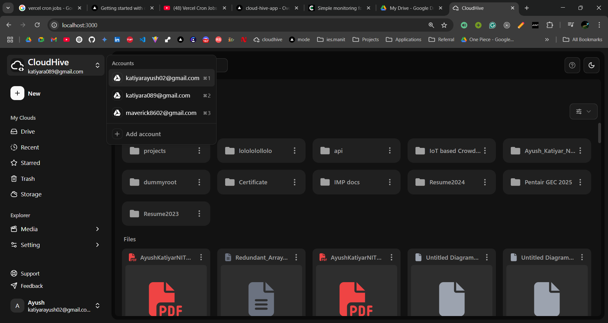
  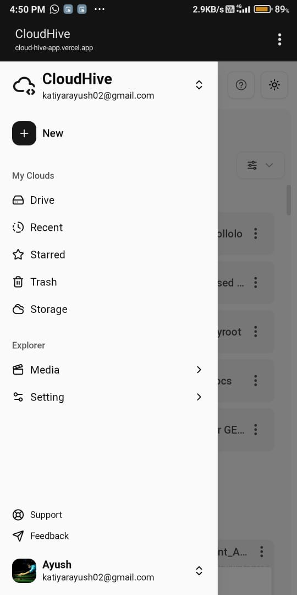
</div>

### Authentication
<div style="display: flex; flex-direction: row; justify-content: space-evenly; flex-wrap: wrap; width:100%; gap: 50px;">
  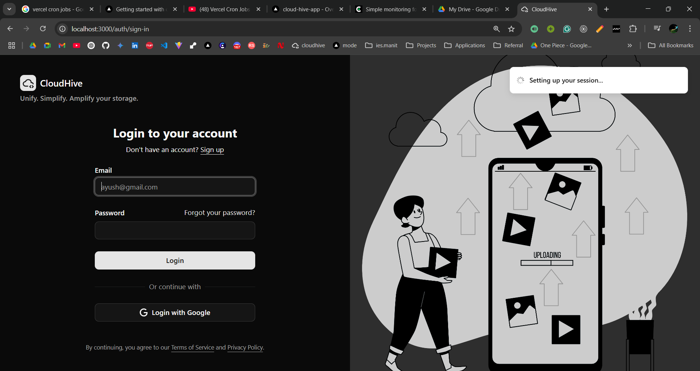
  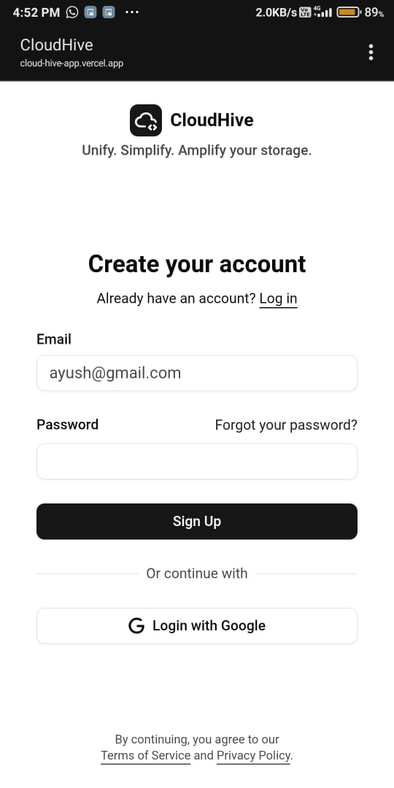
</div>

### Storage Overview
<div style="display: flex; flex-direction: row; justify-content: space-evenly; flex-wrap: wrap; width:100%; gap: 50px;">
  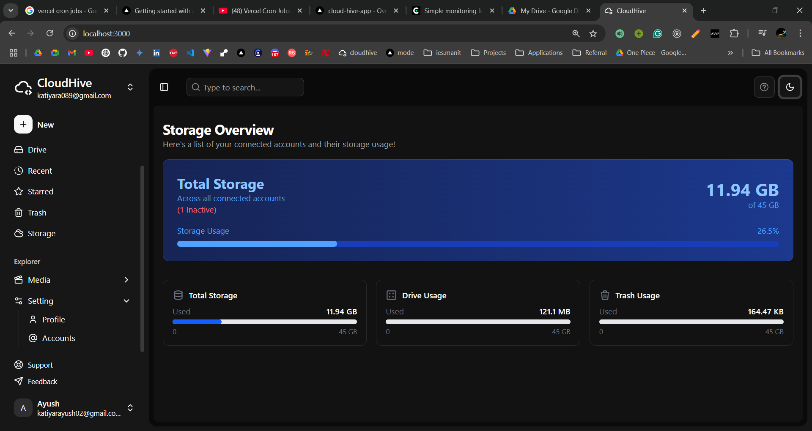
  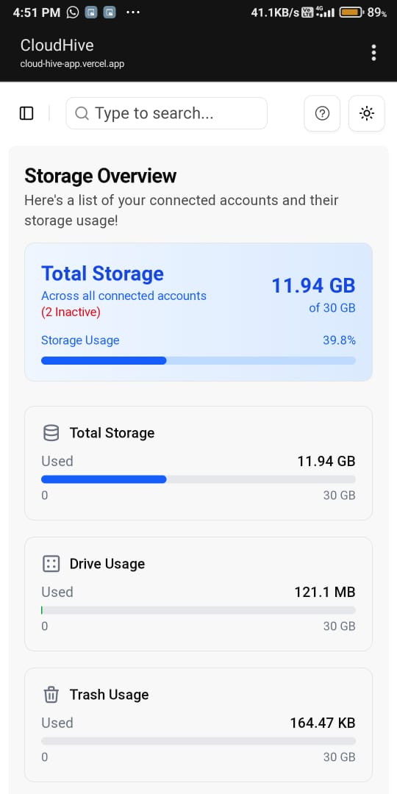
</div>

### Account Management
<div style="display: flex; flex-direction: row; justify-content: space-evenly; flex-wrap: wrap; width:100%; gap: 50px;">
  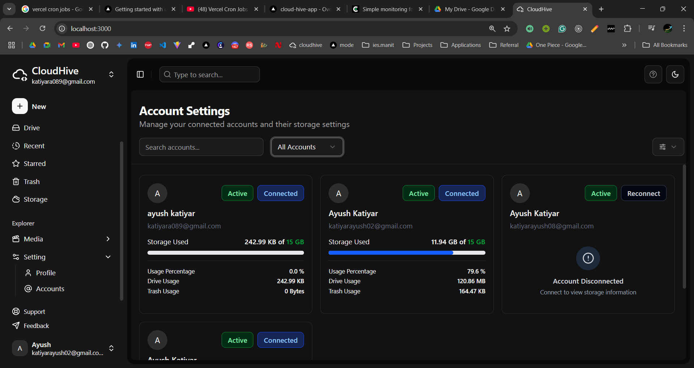
  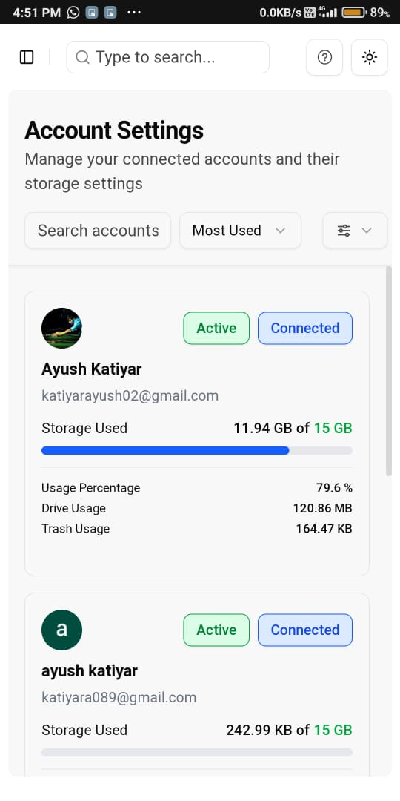
</div>

### User Profile
<div style="display: flex; flex-direction: row; justify-content: space-evenly; flex-wrap: wrap; width:100%; gap: 50px;">
  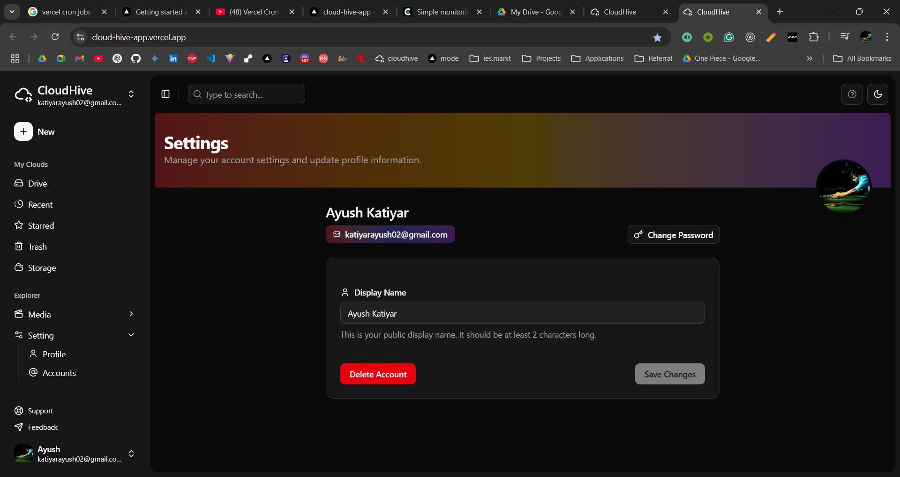
  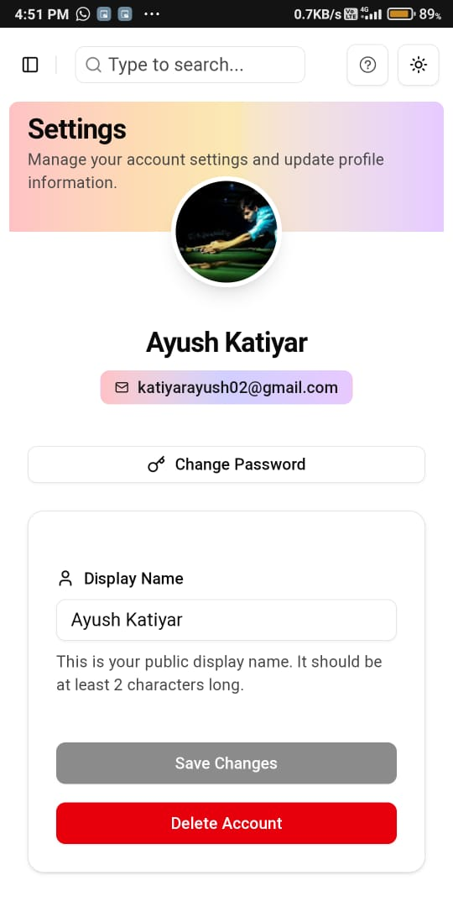
</div>

### Additional  Features
<div style="display: flex; flex-direction: row; justify-content: space-evenly; flex-wrap: wrap; width:100%; gap: 50px;">
  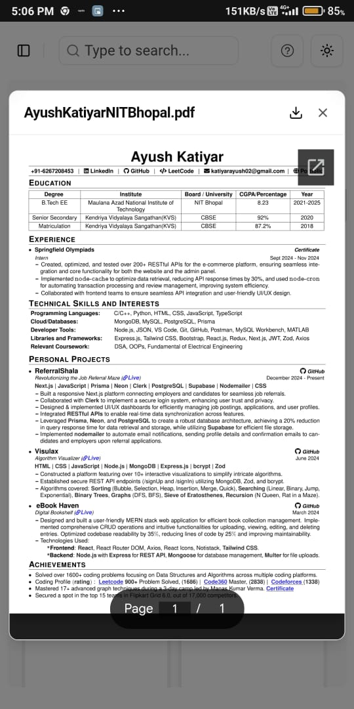
  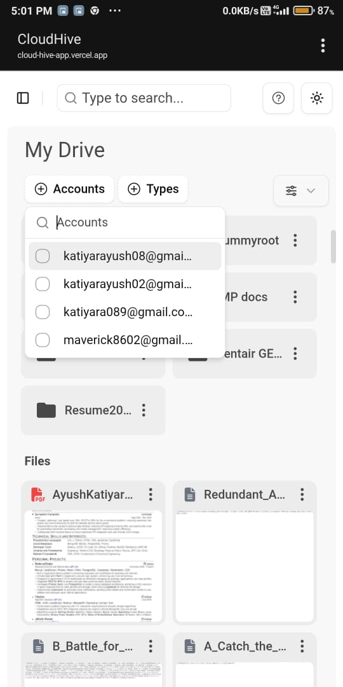
  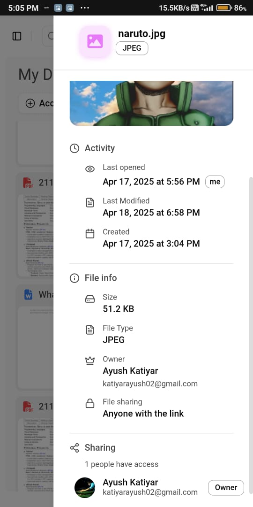
  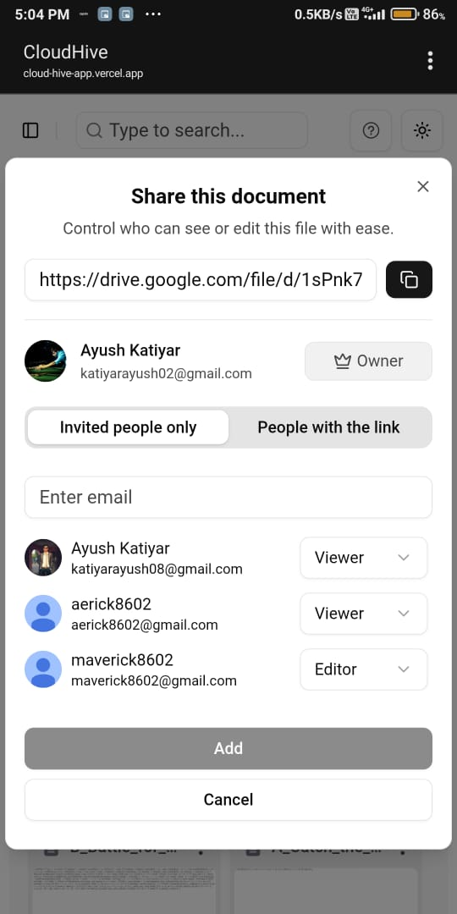
</div>


<p>
  &nbsp;&nbsp;&nbsp;&nbsp;&nbsp;&nbsp;&nbsp;&nbsp;&nbsp;&nbsp;📱 <strong>Quick Preview</strong>&nbsp;&nbsp;&nbsp;&nbsp;&nbsp;&nbsp;&nbsp;
  &nbsp;&nbsp;&nbsp;&nbsp;&nbsp;&nbsp;&nbsp;&nbsp;&nbsp;&nbsp;&nbsp;&nbsp;&nbsp;&nbsp;🔍 <strong>Smart Filtering</strong>&nbsp;&nbsp;&nbsp;&nbsp;&nbsp;&nbsp;&nbsp;&nbsp;&nbsp;
  &nbsp;&nbsp;&nbsp;&nbsp;&nbsp;&nbsp;&nbsp;&nbsp;&nbsp;&nbsp;&nbsp;&nbsp;&nbsp;&nbsp;📋 <strong>Detailed View</strong>&nbsp;&nbsp;&nbsp;&nbsp;&nbsp;&nbsp;&nbsp;&nbsp;
  &nbsp;&nbsp;&nbsp;&nbsp;&nbsp;&nbsp;&nbsp;&nbsp;&nbsp;&nbsp;&nbsp;&nbsp;&nbsp; 🔗 <strong>Easy Sharing</strong>&nbsp;&nbsp;&nbsp;&nbsp;&nbsp;&nbsp;&nbsp;&nbsp;&nbsp;&nbsp;&nbsp;
</p>


<div style="display: flex; flex-direction: row; justify-content: space-evenly; flex-wrap: wrap; width:100%; gap: 30px; margin-top: 20px;">
  <div style="flex: 1; min-width: 250px; max-width: 300px; padding: 20px; background: #f8f9fa; border-radius: 8px; box-shadow: 0 2px 4px rgba(0,0,0,0.1);">
    <h4 style="margin: 0 0 10px 0; color: #2d3748;">📱 Quick Preview</h4>
    <p style="margin: 0; color: #4a5568;">Instant file previews for multiple formats including images, PDFs, documents, and videos. Features include:</p>
    <ul style="margin: 10px 0 0 0; color: #4a5568; padding-left: 20px;">
      <li>Native image and video player</li>
      <li>PDF document viewer</li>
      <li>Text file preview with syntax highlighting</li>
      <li>Office document preview (Word, Excel, PowerPoint)</li>
    </ul>
  </div>
  
  <div style="flex: 1; min-width: 250px; max-width: 300px; padding: 20px; background: #f8f9fa; border-radius: 8px; box-shadow: 0 2px 4px rgba(0,0,0,0.1);">
    <h4 style="margin: 0 0 10px 0; color: #2d3748;">🔍 Smart Filtering</h4>
    <p style="margin: 0; color: #4a5568;">Advanced filtering system with multiple criteria:</p>
    <ul style="margin: 10px 0 0 0; color: #4a5568; padding-left: 20px;">
      <li>Filter by file type, size, and date</li>
      <li>Search within file contents</li>
      <li>Recent and starred items</li>
    </ul>
  </div>
  
  <div style="flex: 1; min-width: 250px; max-width: 300px; padding: 20px; background: #f8f9fa; border-radius: 8px; box-shadow: 0 2px 4px rgba(0,0,0,0.1);">
    <h4 style="margin: 0 0 10px 0; color: #2d3748;">📋 Detailed View</h4>
    <p style="margin: 0; color: #4a5568;">Comprehensive file information and management:</p>
    <ul style="margin: 10px 0 0 0; color: #4a5568; padding-left: 20px;">
      <li>File metadata and properties</li>
      <li>Version history and changes</li>
      <li>Sharing status and permissions</li>
      <li>Storage usage analytics</li>
      <li>Quick actions menu</li>
    </ul>
  </div>
  
  <div style="flex: 1; min-width: 250px; max-width: 300px; padding: 20px; background: #f8f9fa; border-radius: 8px; box-shadow: 0 2px 4px rgba(0,0,0,0.1);">
    <h4 style="margin: 0 0 10px 0; color: #2d3748;">🔗 Easy Sharing</h4>
    <p style="margin: 0; color: #4a5568;">Flexible sharing options with granular control:</p>
    <ul style="margin: 10px 0 0 0; color: #4a5568; padding-left: 20px;">
      <li>Share via link or email</li>
      <li>Custom access permissions</li>
    </ul>
  </div>
</div>

## 🛠️ Tech Stack

- **Frontend**: Next.js 14 (App Router), TypeScript, Tailwind CSS
- **Database**:  MongoDB
- **Authentication**: Firebase Authentication
- **Caching**: Redis
- **Cloud Storage**: Google Drive API
- **Deployment**: Vercel
- **Monitoring**: Vercel Analytics

## 🔄 Automated Processes

### Token Management
- Daily cron job to validate refresh tokens
- Automatic deactivation of expired accounts
- Smart cache invalidation for affected users
- Secure token refresh mechanism

### Caching Strategy
- Redis-based caching for optimal performance
- Automatic cache invalidation on account updates
- Smart cache management for user sessions

## 📁 Project Structure

```
cloudhive-app/
├── .env
├── package.json
├── README.md
├── public/
│   └── [assets, icons, demo images]
├── src/
│   ├── app/
│   │   └── [pages, API routes, auth, error handling]
│   ├── components/
│   │   └── [UI components, dialogs, cards, navigation, uploads]
│   ├── hooks/
│   │   └── [custom React hooks]
│   ├── interface/
│   │   └── [TypeScript interfaces]
│   ├── lib/
│   │   └── [auth, db, cache, Firebase, Google, utilities]
│   ├── types/
│   │   └── [shared TypeScript types]
│   ├── utils/
│   │   └── [API handlers, formatters, mimetypes, icons]
│   └── middleware.ts
├── next.config.ts
├── tsconfig.json
└── vercel.json
```

## 🤝 Contributing

Contributions are welcome! Please feel free to submit a Pull Request.

## 📧 Contact

For any queries or support, please reach out to [katiyarayush02@gmail.com](mailto:katiyarayush02@gmail.com)
